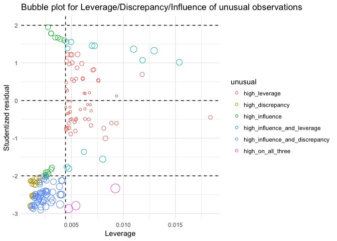
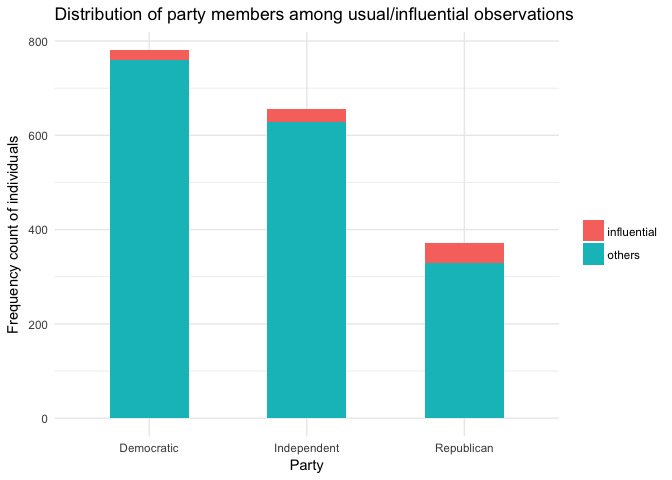
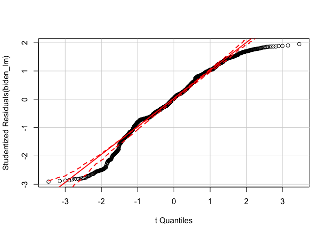
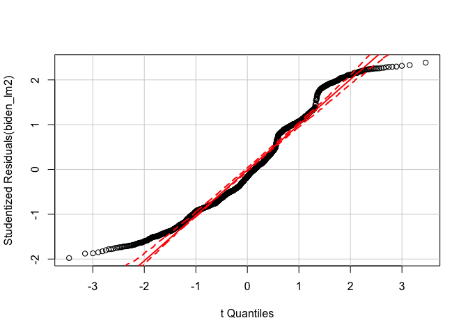
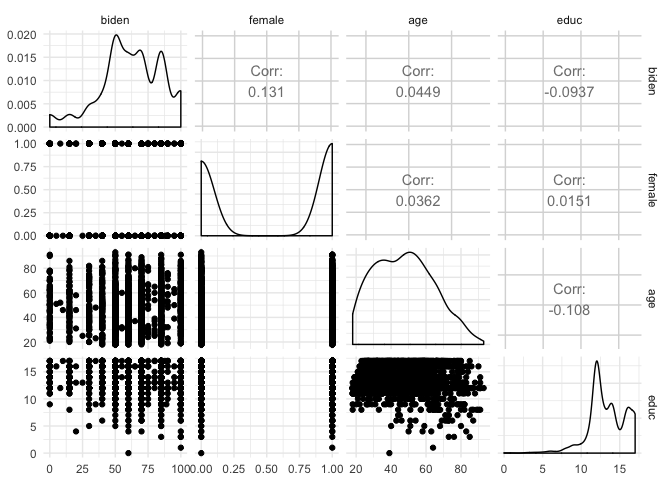
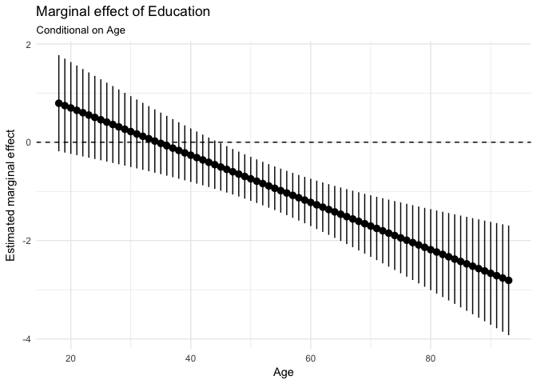
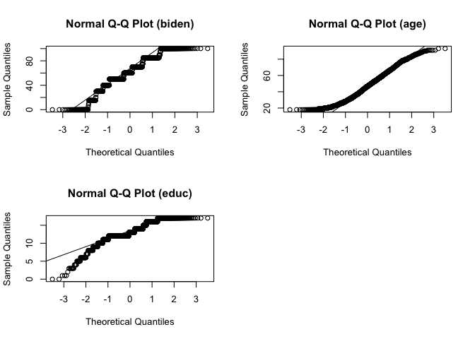
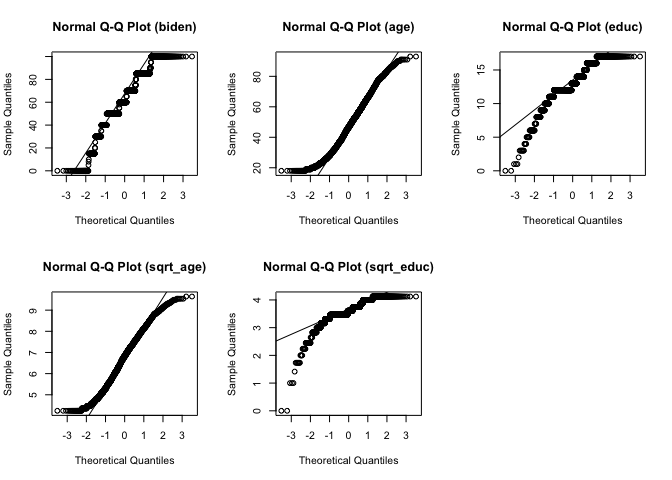

HodgepodgePS
================
Ningyin Xu
5/12/2017

-   [Regression diagnostics](#regression-diagnostics)
    -   [1. Unusual/Influential Observations.](#unusualinfluential-observations.)
    -   [2. Non-normally distributed errors.](#non-normally-distributed-errors.)
    -   [3. Heteroscedasticity](#heteroscedasticity)
    -   [4. Multicollinearity](#multicollinearity)
-   [Interaction terms](#interaction-terms)
    -   [1. Marginal effect of age](#marginal-effect-of-age)
    -   [2. Marginal effect of education](#marginal-effect-of-education)
-   [Missing data](#missing-data)
    -   [Multivariate Normality](#multivariate-normality)
    -   [Estimating linear regression model](#estimating-linear-regression-model)

Regression diagnostics
----------------------

### 1. Unusual/Influential Observations.

The above bubble plot gives us a basic image of the unusual and influential observations (amount: 167) in this data set. Among these, 90 observations have high influence, brought by either high leverage or discrepancy, on our estimates. They're mostly located in the lower left part in the above plot, meaning that they have high discrepancy but low leverage. Since the amount of these unusual obs is large, we better inspect our model before we drop these observations.

The above plot shows us the difference between unusual/influential obs. and other obs. regarding which party they belong. Interestingly, while the portion of Republicans in the usual obs. is the smallest, its portion in unusual/influential obs. is higher than the other two party groups. This implies that the fact that we didn't include the influence of party in our model may be the reason for these unusual observations. Moving forward with the research, I might consider add the two variables *D**e**m* and *R**e**p* to control for this influential effect.

### 2. Non-normally distributed errors.

    ##          term estimate std.error statistic  p.value
    ## 1 (Intercept)  68.6210    3.5960     19.08 4.34e-74
    ## 2         age   0.0419    0.0325      1.29 1.98e-01
    ## 3      female   6.1961    1.0967      5.65 1.86e-08
    ## 4        educ  -0.8887    0.2247     -3.96 7.94e-05

From the *quantile-comparison plot* and the density plot of the studentized resudials, One can tell there exist non-normally distributed errors. Power and log transformations are typically used to correct this problem. Here I use 2-power transformation, the variable *a**g**e* is statistically more significant than before, but I wouldn't say this gives the ideal outcome that a researcher is looking for. I would suggest adjust this model based on my answer to the first question and then consider this.

    ##          term estimate std.error statistic  p.value
    ## 1 (Intercept)  4875.65    422.12     11.55 7.99e-30
    ## 2         age     9.93      3.81      2.60 9.31e-03
    ## 3      female   690.09    128.74      5.36 9.37e-08
    ## 4        educ   -98.39     26.38     -3.73 1.97e-04

### 3. Heteroscedasticity

    ## 
    ##  studentized Breusch-Pagan test
    ## 
    ## data:  biden_lm
    ## BP = 20, df = 3, p-value = 5e-05

From the residual plot and the result of Breusch-Pagan test, one can tell heteroscedasticity is present.

    ##          term estimate std.error statistic   p.value
    ## 1 (Intercept)  69.0173   0.33678     204.9  0.00e+00
    ## 2         age   0.0388   0.00227      17.1  6.35e-61
    ## 3      female   5.9697   0.12875      46.4 1.20e-309
    ## 4        educ  -0.9098   0.02879     -31.6 9.45e-175

Comparing to the original results, changes in estimated parameters are mild, but standard errors are much smaller. Let's try the other estimation proedure: *Huber-White standard errors*.

    ##          term estimate std.error statistic  p.value std.error.rob
    ## 1 (Intercept)  68.6210    3.5960     19.08 4.34e-74        3.5500
    ## 2         age   0.0419    0.0325      1.29 1.98e-01        0.0333
    ## 3      female   6.1961    1.0967      5.65 1.86e-08        1.1064
    ## 4        educ  -0.8887    0.2247     -3.96 7.94e-05        0.2226

### 4. Multicollinearity

    ##    age female   educ 
    ##   1.01   1.00   1.01

The correlation matrices and variance inflation factor(VIF) show that there's no multicollinearity in this model.

Interaction terms
-----------------

    ##          term estimate std.error statistic  p.value
    ## 1 (Intercept)   38.374    9.5636      4.01 6.25e-05
    ## 2         age    0.672    0.1705      3.94 8.43e-05
    ## 3        educ    1.657    0.7140      2.32 2.04e-02
    ## 4    age:educ   -0.048    0.0129     -3.72 2.03e-04

### 1. Marginal effect of age

    ## Linear hypothesis test
    ## 
    ## Hypothesis:
    ## age  + age:educ = 0
    ## 
    ## Model 1: restricted model
    ## Model 2: biden ~ age + educ + age * educ
    ## 
    ##   Res.Df    RSS Df Sum of Sq    F Pr(>F)    
    ## 1   1804 985149                             
    ## 2   1803 976688  1      8461 15.6  8e-05 ***
    ## ---
    ## Signif. codes:  0 '***' 0.001 '**' 0.01 '*' 0.05 '.' 0.1 ' ' 1

The marginal effect of age is statistically significant. The magnitude and direction can be seen from the plot.

### 2. Marginal effect of education

    ## Linear hypothesis test
    ## 
    ## Hypothesis:
    ## educ  + age:educ = 0
    ## 
    ## Model 1: restricted model
    ## Model 2: biden ~ age + educ + age * educ
    ## 
    ##   Res.Df    RSS Df Sum of Sq    F Pr(>F)  
    ## 1   1804 979537                           
    ## 2   1803 976688  1      2849 5.26  0.022 *
    ## ---
    ## Signif. codes:  0 '***' 0.001 '**' 0.01 '*' 0.05 '.' 0.1 ' ' 1

The marginal effect of age is statistically significant (95%). The magnitude and direction can be seen from the plot.

Missing data
------------

### Multivariate Normality

    ##    Mardia's Multivariate Normality Test 
    ## --------------------------------------- 
    ##    data : biden_num 
    ## 
    ##    g1p            : 1.03 
    ##    chi.skew       : 313 
    ##    p.value.skew   : 3.42e-61 
    ## 
    ##    g2p            : 16.1 
    ##    z.kurtosis     : 4.26 
    ##    p.value.kurt   : 2.06e-05 
    ## 
    ##    chi.small.skew : 313 
    ##    p.value.small  : 2.35e-61 
    ## 
    ##    Result          : Data are not multivariate normal. 
    ## ---------------------------------------

 From the above graph and the result from Mardia's MVN test, one can tell this dataset is not multivariate normal. From the plot, it seems that we could use square-root-transformation on age and education.

    ##    Mardia's Multivariate Normality Test 
    ## --------------------------------------- 
    ##    data : biden_trans %>% select(sqrt_educ, sqrt_age) 
    ## 
    ##    g1p            : 3.91 
    ##    chi.skew       : 1482 
    ##    p.value.skew   : 1.26e-319 
    ## 
    ##    g2p            : 17.3 
    ##    z.kurtosis     : 55.5 
    ##    p.value.kurt   : 0 
    ## 
    ##    chi.small.skew : 1485 
    ##    p.value.small  : 2.47e-320 
    ## 
    ##    Result          : Data are not multivariate normal. 
    ## ---------------------------------------

 Although still not multivariate normal according to the test, the results are better than before.

### Estimating linear regression model

    ## # A tibble: 20 × 6
    ##       id        term estimate std.error statistic   p.value
    ##    <chr>       <chr>    <dbl>     <dbl>     <dbl>     <dbl>
    ## 1   imp1 (Intercept)  63.8118    2.9807     21.41  6.19e-93
    ## 2   imp1         age   0.0377    0.0276      1.37  1.72e-01
    ## 3   imp1      female   6.0213    0.9589      6.28  4.04e-10
    ## 4   imp1        educ  -0.5381    0.1847     -2.91  3.62e-03
    ## 5   imp2 (Intercept)  65.2828    3.0004     21.76  1.14e-95
    ## 6   imp2         age   0.0501    0.0277      1.81  7.06e-02
    ## 7   imp2      female   6.0166    0.9641      6.24  5.16e-10
    ## 8   imp2        educ  -0.6857    0.1860     -3.69  2.32e-04
    ## 9   imp3 (Intercept)  66.6340    3.0287     22.00  1.38e-97
    ## 10  imp3         age   0.0407    0.0282      1.45  1.49e-01
    ## 11  imp3      female   5.8465    0.9805      5.96  2.86e-09
    ## 12  imp3        educ  -0.7221    0.1882     -3.84  1.27e-04
    ## 13  imp4 (Intercept)  68.5374    2.9987     22.86 1.91e-104
    ## 14  imp4         age   0.0524    0.0279      1.88  6.02e-02
    ## 15  imp4      female   5.3861    0.9696      5.55  3.10e-08
    ## 16  imp4        educ  -0.8984    0.1860     -4.83  1.45e-06
    ## 17  imp5 (Intercept)  66.4051    2.9670     22.38 1.30e-100
    ## 18  imp5         age   0.0507    0.0275      1.84  6.53e-02
    ## 19  imp5      female   5.6317    0.9571      5.88  4.59e-09
    ## 20  imp5        educ  -0.7317    0.1842     -3.97  7.31e-05

    ## [1] "Comparison between imputed model and original model"

    ##          term estimate std.error estimate.mi std.error.mi
    ## 1 (Intercept)  68.6210    3.5960     66.1342       3.5547
    ## 2         age   0.0419    0.0325      0.0463       0.0287
    ## 3      female   6.1961    1.0967      5.7804       1.0110
    ## 4        educ  -0.8887    0.2247     -0.7152       0.2332

From the above table, we can see that there's no significant change between imputed model and original one. Mostly because 1) this dataset doesn't have too much missing value, especially the circumstance where one variable has a lot of missing values, which makes the influence of imputation limited; 2) the multivariate normality didn't get addressed properly in this exercise, so the results don't show a significant change.
